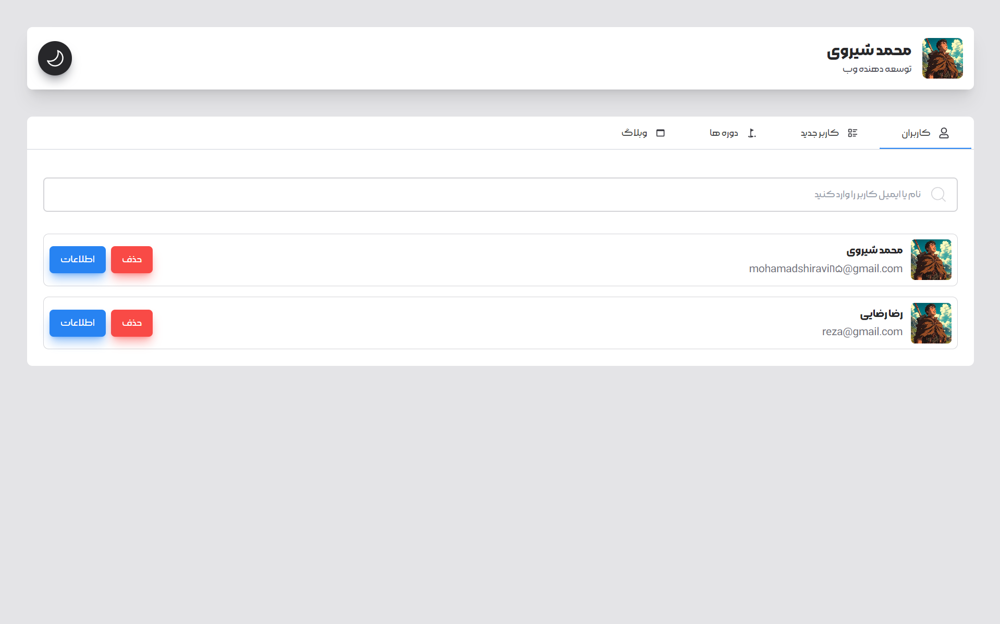

<h1 align="center">
  <br>
  <a href="https://github.com/Mohamadshiravi/cms-panel.git"></a>
</h1>

<h4 align="center">A full-stack cms panel with typeScript and Redux</h4>

<p align="center">
    
    
    
    
</p>

<br/>

### Features:

- **add,delete user**
- **add,delete course**
- **add,delete blog**
- **dark mode**
- **state manager with redux**
- **animate modal**
- **client search with redux**
- **modern add userForm with formik**
- **clone vercel navbar animaion**

<h1 align="center">
  <a href="https://github.com/Mohamadshiravi/cms-panel.git"></a>
</h1>

Live on [https://my-cms-panel.vercel.app/](https://my-cms-panel.vercel.app/)
<br />

## Run Project on local

**Note:**

> !!! You need MongoDB for Run Project

add This environment variables to run project :

```bash
MONGODB_URI : your mongodb connection string
```

And, You Need build Project By :

```bash
npm run build
# or
yarn build
# or
pnpm build
```

Next Run with :

```bash
npm run start
# or
yarn start
# or
pnpm start
```

Open [http://localhost:3000](http://localhost:3000) with your browser to see the project
